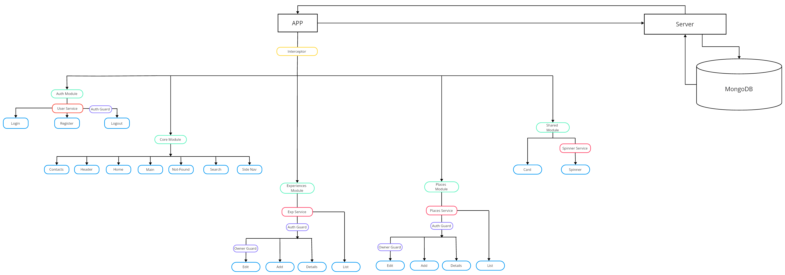

# <a align="center" href="https://me2-angular-d82fe.web.app/home">Me2</a>

<p align="left">
  <a>
    
  </a>
</p>

#### Front-end:
<p align="left">
  <a>
    
  </a>
</p>

#### Back-end:
<p align="left">
  <a>
    
  </a>
</p>

## Table of Contents

1. [Introduction](#introduction)
2. [Overview](#overview)
3. [Features](#features)
   - [Home](#home)
   - [Search](#search)
   - [Places](#places)
   - [Experiences](#experiences)
   - [Contacts](#contacts)
4. [Getting Started](#getting-started)
   - [Installation](#installation)
5. [Structure](#structure) 
6. [Host](#host)


## Introduction <a name="introduction"></a>

Application is a platform designed for users to share and discover positive experiences or enjoyable places they've encountered. The application serves as a community-driven space where positivity is the central theme, allowing users to explore, contribute, and connect through shared experiences and places. 

## Overview <a name="overview"></a>

- Sidebar: A collapsible sidebar on the left side of the screen provides navigation options.
- Header/User dashboard: Located at the top of the screen:
  - For visitors : includes "Sign Up" and "Sign In" options for visitors.
  - For logged-in users : 
      - Displays two buttons on the left side: one for adding experiences and one for adding places.
      - Displays on the right side the user's email and a logout button.
- Main section: dynamically renders the content based on the user's navigation choices and interactions. 

## Features <a name="features"></a>

## Homepage <a name="home"></a>

The Home Page is designed to welcome visitors and immediately engage them with the core value of the application - sharing and discovering positive experiences and places. It features:

- Welcome message.

- Recent Experiences: Showcases the latest three posts shared by users in the experiences category. This allows new visitors and users to gain insight of positive content they can explore further in the app.

- Recent Places: Displays the latest three posts about places, interesting locations that users have enjoyed. Like experiences, this section is updated dynamically to reflect the most recent contributions.

## Search <a name="search"></a>

The Search Page empowers users to find specific experiences or places tailored to their preferences. Key features include:

- Search by City or Title (Places): Users can enter the name of a city or a title related to a place they're interested in exploring. The search results will display relevant places matching the entered criteria.

- Search by Service Name (Experiences): Users can search for experiences based on the name of the service provided. This allows users to discover experiences related to various professions or services offered by individuals.

The search functionality is designed to provide accurate and relevant results, enhancing the user's ability to find exactly what they're looking for.

## Places <a name="places"></a>

The Places view serves as a directory of all the places shared by users within the community. Key features include:

- Listing of Shared Places: 
  - Visitors to the Places view can browse through a list of all the places shared by users, including their titles and brief descriptions.

- Accessing Detailed Information: 
  - While all visitors can view the titles and part of descriptions of shared places, access to detailed information about a specific place is restricted to registered users. To access additional information for a particular place, users must log in or sign up for an account.

When a user navigates to the detail view of a shared place, the following features are available:

- Detailed Information: The detail view provides comprehensive information about the place.
- Owner Privileges: If the user is the owner of the shared place, they have special privileges to edit or delete the post.


## Experiences <a name="experiences"></a>

The Experiences view offers visitors the opportunity to explore a wide range of shared experiences contributed by users.

Listing of Shared Experiences: Visitors can browse through a comprehensive list of experiences posted by members of the community.Each experience includes information about the service provider, such as: service title, service provider(specifies the person or entity providing the service), contact(the phone number of the service provider)and description(detailed overview of the experience being shared).

Accessing Detailed Information: Clicking on the title of an experience opens a detailed view, providing visitors with additional information about the experience.

Owner Privileges: If the visitor is the owner of the posted experience, they have special privileges to edit or delete the post directly from the detailed view.

## Contacts <a name="contacts"></a>

Visitors can find information about our email address and social networks.

Email Link: Clicking on the email link directly opens an email form with our email address pre-filled,and send it directly from their preferred email client.


## Getting Started <a name="getting-started"></a>

## Installation <a name="installation"></a>

clone repository
```
git clone https://github.com/viiktorstefanov/me2-angular.git
```
navigate to the "client" folder:
```
cd client
```
Type in the terminal
```
npm i
```
Install all dependecies and then go for:

```
npm run start
```

Open new terminal and type:
```
cd ../
```
```
cd server
```
Install all dependecies for the server: 
```
npm i
```
Then run the server:

```
npm start
```

## Structure <a name="structure"></a>
<a>
    
</a>

## Host <a name="host"></a>

- Front-End deployed on Firebase.
- Back-End: only local.

You can see it here: <a href="https://me2-angular-d82fe.web.app/home">Me2</a>


